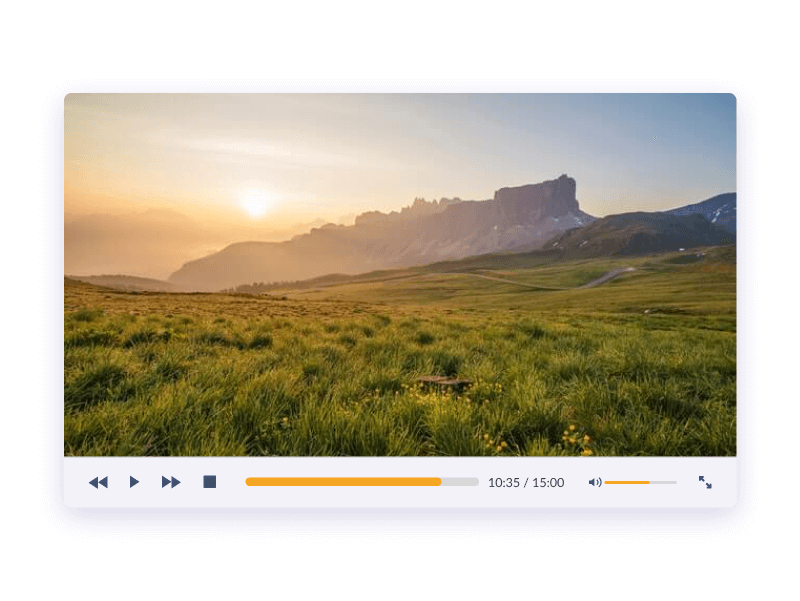

**Challenge Title**
Video Player Web App

**Challenge Description**
You'll learn how to use HTML5 video API and handle user interactions. Plus, you'll also learn how to use DOM manipulation to manipulate the data.

**Difficulty Level**
hard

**Tags**
FRONTEND

**Learning**
You'll learn to use [HTML5 video API](https://developer.mozilla.org/en-US/docs/Learn/JavaScript/Client-side_web_APIs/Video_and_audio_APIs) and handle user interactions. Plus, you'll also learn how to use DOM manipulation to manipulate the DOM.

**Requirements**

- Play/Pause a video
- Stop a video
- Increase or Decrease the volume of the video
- Mute a video
- See the video in full-screen
- Show remaining video time
- Navigate to the next or previous video in their playlist

I hope you'll enjoy building this challenge.

Feel free to share your solution on the website or on social media and tag us.
